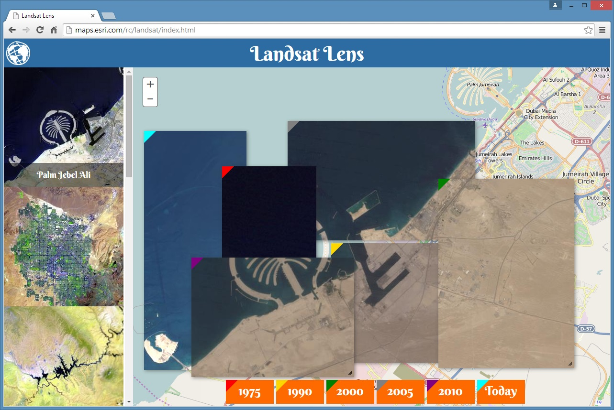

# Landsat Lens

This mapping application allows users to look back in time with Landsat time windows.

Click [here](http://maps.esri.com/rc/landsat/index.html) or [here](http://richiecarmichael.github.io/landsat/index.html) to view the live application.

#### This application makes use of the following map services

#### This application makes use of the following libraries

* [ArcGIS API for JavaScript](https://developers.arcgis.com/javascript/) by [Esri](http://www.esri.com/)
  - Esri’s JavaScript library for mapping and analysis.
* [Esri Proxy](https://github.com/Esri/resource-proxy) by [Esri](http://www.esri.com/)
  - Proxy files for DotNet, Java and PHP.
* [jQuery](http://jquery.com/) by jQuery Foundataion Inc
  - A JavaScript framework for DOM manipulation and a foundation for many other frameworks.
* [jQuery UI](http://jqueryui.com) by [Copyright jQuery Foundation](https://jquery.org/)
  - User interface extension to jQuery.
  
#### A new puzzle for Venice, Italy

